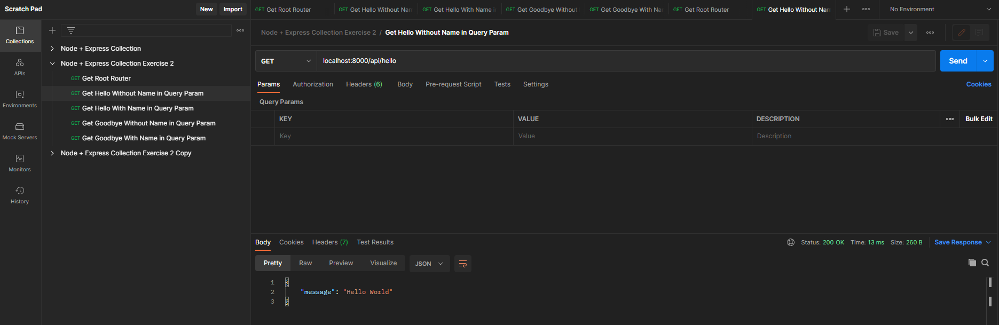

# Ejercicio 2 del Curso de MERN de OpenBootcamp

## Dependencias instaladas del ejercicio 2

### 1. Dependencias de producción

> Son dependencias instaladas tanto para el entorno de desarrollo como para el entorno de producción.

* #### cors en su versión ^2.8.5:
    > cors - Intercambio de recursos de origen cruzado - Utiliza cabeceras HTTP adicionales para permitir acceder a recursos de un servidor de un dominio distinto del que pertenece.

* #### helmet en su versión ^6.0.0:
    > Es un módulo de Node que ayuda a proteger los encabezados HTTP.

### 2. Dependencias de desarrollo

> Son dependencias instaladas solamente para el entorno de desarrollo.

* #### @types/cors en su versión ^2.8.12:

    > Contiene las definiciones de cors para TypeScript.

## Dependencias instaladas del ejercicio 1

### 1. Dependencias de producción

> Son dependencias instaladas tanto para el entorno de desarrollo como para el entorno de producción.

* #### Express en su versión ^16.0.2:
    > Es un framework para el entorno de ejecución NodeJS que ayuda a configurar un entorno de desarrollo y realizar tareas de desarrollo y publicación web.

* #### Dotenv en su versión ^4.18.1:
    > Es una librería para tener un archivo de configuración que contiene todas las variables de entorno que se crean.

### 2. Dependencias de desarrollo

> Son dependencias instaladas solamente para el entorno de desarrollo.

* #### @types/express en su versión ^4.17.14:
    > Es un paquete para que TypeScript reconozca los tipos de Express.

* ### @types/jest en su versión ^29.0.3:
    > Contiene las definiciones de Jest para TypeScript.

* ### @types/node en su versión ^18.7.20:
    > Contiene las definiciones de node para TypeScript.

* ### @typescript-eslint/eslint-plugin en su versión ^5.38.0:
    > Un plugin que proporciona reglas recomendadas para TypeScript.

* ### concurrently en su versión ^7.4.0:
    > Para ejecutar varios scripts en paralelo.

* ### eslint en su versión ^8.24.0:
    > Analiza el código de JavaScript para detectar problemas por medio de patrones y, si está a su alcance, resolverlos él mismo.

* ### eslint-config-standard-with-typescript en su versión ^23.0.0:
    > Una extensión de configuración estandard de eslint para TypeScript.

* ### eslint-plugin-import en su versión ^2.26.0:
    > Plugin soporte de eslint para EcmaScript 6 con la sintaxis import / export.

* ### eslint-plugin-n en su versión ^15.3.0:
    > Reglas de Eslint adicionales para NodeJS.

* ### eslint-plugin-promise en su versión ^6.0.1:
    > Refuerza mejores prácticas para promesas en JavaScript.

* ### jest en su versión ^29.0.3:
    > Librería para escribir y ejecutar tests para pruebas de código.

* ### nodemon en su versión ^2.0.20:
    > Es una utilidad para monitorizar los cambios en el código que se está desarrollando para reiniciar el servidor automáticamente.

* ### serve en su versión ^14.0.1:
    > Servidor local para levantar el proyecto en una página web local.

* ### supertest en su versión ^6.2.4:
    > Librería de SuperAgent para testear servidores HTTP.

* ### ts-jest en su versión ^29.0.2:
    > Una extensión de Jest que permite utilizarlo para probar proyectos en realizados en TypeScript.

* ### ts-node en su versión ^10.9.1:
    > Motor de ejecución de TypeScript para transformarlo en JavaScript, permite ejecutar TypeScript en NodeJs sin precompilar.

* ### typescript en su versión ^4.8.3:
    > Lenguaje de progrmación que compila a JavaScript añadiendole tipado.

* ### webpack en su versión ^5.74.0:
    > Se encarga de empaquetar los módulos de la aplicación y genera un archivo único con ellos para producción.

* ### webpack-cli en su versión ^4.10.0:
    > Proporciona un conjunto de comandos para aumentar la velocidad al configurar un proyecto webpack personalizado.

* ### webpack-node-externals en su versión ^3.0.0:
    > Excluye la carpeta node_modules del paquete generado por webpack.

* ### webpack-shell-plugin en su versión ^0.5.0:
    > Permite lanzar comandos antes y después de los paquetes generados.

## Scripts de NPM creados:

> Scripts creados para facilitar el lnazamiento de instrucciones por consola en desarrollo y para producción.

* ### "build": "npx tsc":
    > Crea una carpeta (Configurada anteriormente en el archivo tsconfig.json) en la que compila TypeScript a JavaScript.

* ### "start": "node dist/index.js":
    > Ejecuta el archivo index.js.

* ### "dev": "concurrently \"npx tsc --watch\" \"nodemon -q dist/index.js\"":
    > Lanza a través de concurrently dos comandos, sirven para desarrollo:
        1. npx tsc: de la que ya se ha hablado antes, crea una carpeta que compila TypeScript a JavaScript y la instruccion --watch en la que se queda escuchando cambios.
        2. nodemon -q dist/index.js: que monitoriza los cambios de código y reinicia el servidor cuando estos se produzcan.

* ### "test": "jest":
    > Lanza la herramienta de pruebas, pasa los tests que se han realizado y muestra si se han pasado o no, crea una carpeta coverage donde recoge el tanto porciento de los aciertos o fallos.

* ### "serve:coverage": "cd coverage/lcov-report && npx serve":
    > Va a la carpeta coverage creada anteriormente, realiza un reporte de los datos de jest y los sirve en una página HTML en un puerto local.

## Variables de entorno:

Por el momento solo hay una:

    PORT=8000

## Pruebas con Postman

 > Incluyo archivo exportado de colección de Postman

### Get Root Router

### Get Hello Whithout Name in Query Param

### Get Hello With Name in Query Param

### Get Goodbye Without Name in Query Param

### Get Goodbye With Name in Query Param

